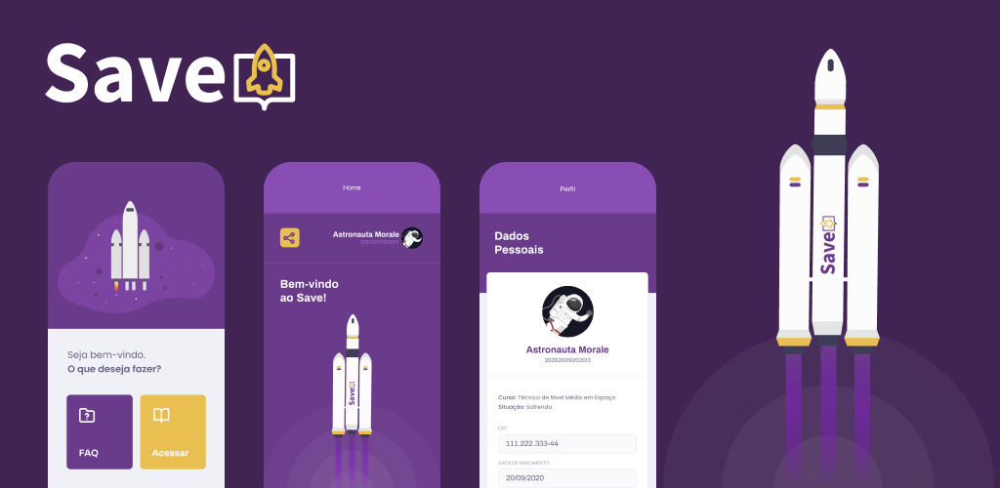
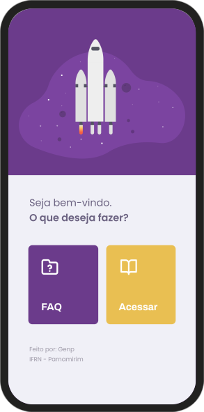

# SAVE - Sistema de Assitência Virtual Estudantil

> O Save é um app de gerenciamento de estudos, feito para alunos do Instituto Federal do Rio Grande do Norte. Criado com React Native e Expo.

 
 
 

 
 
 
 

## Funcionalidades:

* Confira seus dados escolares
* Obtenha materiais de aula
* Veja suas notas e informações
* Altere sua foto de perfil
* Intuitivo e descomplicado
